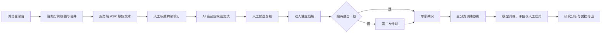

<div align="center">
  
  <h1>知见 · 元认知测评系统</h1>
  <h4>面向真实问题解决情境的标准化出声思维测评、专家编码与模型研究平台</h4>
</div>

<div align="center">
  <a href="https://github.com/eternal12138/Zhijian-MetaAssessment/actions/workflows/ci.yml"></a>
  <a href="LICENSE"></a>
  <a href="https://www.python.org/"></a>
  <a href="https://vuejs.org/"></a>
  <a href="https://www.docker.com/"></a>
</div>

<div align="center">
  <strong>简体中文</strong> · <a href="README_EN.md">English</a>
</div>

## ℹ️ 关于项目

“知见”是一套面向元认知研究的全链路 Web 系统。系统通过标准化问题解决任务与出声思维协议采集过程数据，将浏览器录音、服务端 ASR、AI 候选清洗、人工转录校订、候选复核、双人盲编、第三方仲裁、模型训练和研究导出组织在同一条可追溯的数据链路中。

系统提供学生、教师和管理员三种角色界面，既支持受控实验数据采集，也支持专家训练数据闭环与三分类模型的持续训练、比较、启用和回滚。

### 🏆 荣誉奖项

- 荣获 **2026年“厚粲杯”全国大学生心理与认知智能测评挑战赛校级选拔赛二等奖**（东北师范大学）。

> [!IMPORTANT]
> 本项目用于学术研究与阶段性测评分析，不属于医疗器械或临床诊断工具。当前报告不应被用于临床诊断、高风险筛查、升学就业决策，也不能替代专业心理测量。
> 
> ***本仓库暂仅供“2026 年“厚粲杯”全国大学生心理与认知智能测评挑战赛”组委会进行比赛评审及交流使用。***

## ✨ 核心能力

- **标准化测评**：知情同意、麦克风检查、出声思维练习、AB/BA 平衡任务顺序、15 秒静默双重提醒与任务后问卷。
- **可靠音频链路**：强制录音、分片校验、原始音频保留、FFmpeg 规范化、异步 ASR、失败重试及不可变转录版本。
- **人工质量控制**：权威转录校订、候选片段复核、原音频与时间区间波形试听、编辑历史和并发锁定。
- **双人盲编与仲裁**：编码员 A/B 独立盲编，一致结果形成共识，分歧交由指定第三方仲裁。
- **研究数据闭环**：同时保留 ASR 原文、AI 清洗文本、AI 标签、每位专家原始标签、共识/仲裁标签与审计记录。
- **分类模型持续训练**：支持 TF-IDF 与远程 Embedding 特征，以及 LinearSVC、LogisticRegression、RandomForest、XGBoost、LightGBM、CatBoost 分类器。
- **模型治理**：训练进度、五折折外评估、ROC/AUC、混淆矩阵、三类 F1、过拟合风险、历史版本对比、人工启用与回滚。
- **受控研究导出**：问卷、原录音、原转录、AI 候选、人工复核文本和专家训练数据分层导出，并记录审计日志。
- **生产部署**：Docker Compose、MySQL、独立异步 Worker、Nginx 与可选 Cloudflare Tunnel，兼顾 2 核 4 GiB 服务器约束。

## 👥 角色与功能兼容性

| 功能 | 学生 | 教师 | 管理员 |
|---|:---:|:---:|:---:|
| 完成标准化测评、录音与问卷 | ✅ | ➖ | ➖ |
| 查看个人阶段性报告 | ✅ | ➖ | ➖ |
| 分配任务顺序与跟踪班级进度 | ➖ | ✅ | ✅ |
| 权威转录校订与候选复核 | ➖ | ✅ | ✅ |
| 双人盲编与第三方仲裁 | ➖ | ✅ | ✅ |
| 使用已启用模型执行三分类 | ➖ | ✅ | ✅ |
| 用户、班级、协议与数据管理 | ➖ | 部分 | ✅ |
| 模型配置、训练、启用与回滚 | ➖ | 查看 | ✅ |
| 受控导出与删除研究数据 | ➖ | 授权范围 | ✅ |

**图例：** ✅ 支持 · 部分/查看/授权范围表示受权限约束 · ➖ 不适用

## 🔬 数据流程



训练分类使用三个元认知维度：`monitoring`（监控）、`regulation`（调控）和 `evaluation`（评估）。`non_metacognitive`（非元认知）用于候选排除与数据质量记录，不进入当前三分类模型训练。

## 🧱 技术架构

| 层级 | 技术与职责 |
|---|---|
| 前端 | Vue 3、TypeScript、Vite、Pinia、Bootstrap 5、ECharts、wavesurfer.js |
| API | FastAPI、Pydantic、异步 SQLAlchemy、JWT、基于角色的访问控制 |
| 数据库 | MySQL 8.4，保存用户、会话、协议、转录版本、编码、模型任务与审计数据 |
| 媒体 | MediaRecorder、Web Audio API、FFmpeg、分片完整性校验和受控音频目录 |
| AI 服务 | OpenAI 兼容 LLM、火山引擎/兼容 ASR、可配置远程 Embedding 服务 |
| 后台任务 | ASR、候选抽取、模型训练、研究导出独立 Worker |
| 部署 | Docker Compose、Nginx、可选 Cloudflare Tunnel、持久化数据卷与备份 |

## 🖥️ 运行要求

### 本地开发

| 组件 | 建议版本 |
|---|---|
| 操作系统 | Windows 10/11 |
| Python | 3.11+（CI 与当前生产镜像使用 3.13） |
| Node.js | 22+ |
| pnpm | 10+ |
| MySQL | 8.4 |
| FFmpeg | 位于 `PATH`，或通过环境变量指定 |

### 单机生产环境

推荐 Ubuntu 24.04、Docker Engine 与 Compose 插件。当前编排已针对 **2 vCPU / 4 GiB RAM** 进行约束：Web API 默认 1 个 Worker，训练 Worker 限制为 2 GiB；生产模型仍应根据实际基准测试选择。

## 🚀 快速开始

### Windows 一键启动

```powershell
git clone https://github.com/eternal12138/Zhijian-MetaAssessment.git
cd Zhijian-MetaAssessment
./dev.ps1 -OpenBrowser
```

也可以双击 `dev.cmd`。首次启动会创建本地环境文件、安装依赖、验证 MySQL、执行幂等迁移并启动前后端。

默认地址：

- 前端：<http://127.0.0.1:5173>
- 后端健康检查：<http://127.0.0.1:8000/api/health/ready>
- API 文档（仅开发环境）：<http://127.0.0.1:8000/docs>

常用命令：

```powershell
./dev.ps1 -Restart       # 重启本项目开发进程
./dev.ps1 -SkipInstall   # 已安装依赖时跳过安装
./stop.ps1               # 停止本地服务
```

> [!NOTE]
> 开发模式会幂等创建 `student`、`teacher`、`admin` 演示账号，初始密码为 `123456`。生产迁移不会创建这些演示账号，而是使用 `BOOTSTRAP_ADMIN_*` 初始化首位管理员。

## 🐳 生产部署

```bash
cp .env.production.example .env.production
docker compose --env-file .env.production config --quiet
docker compose --env-file .env.production up -d --build
curl -fsS http://127.0.0.1:8080/api/health/ready
```

需要 Cloudflare Tunnel 时增加 `--profile tunnel`。完整的阿里云部署、更新、备份、安全与验收流程请阅读 [DEPLOY_ALIYUN.md](DEPLOY_ALIYUN.md)。

> [!WARNING]
> 不要提交 `.env`、`.env.production`、API Key、数据库密码、录音、转录、问卷、模型训练数据或导出压缩包。生产环境必须更换 `SECRET_KEY`、数据库密码和初始管理员密码，并关闭公开注册与 API 文档。

## ⚙️ 服务组成

| Compose 服务 | 作用 |
|---|---|
| `frontend` | Nginx 托管前端并反向代理 `/api` |
| `backend` | FastAPI 业务 API，模型按进程加载并复用 |
| `db` | MySQL 持久化数据库 |
| `migrate` | 一次性幂等数据库迁移与协议初始化 |
| `asr-worker` | 音频合并、转码与异步语音识别 |
| `extraction-worker` | AI 候选片段抽取与版本化 |
| `model-training-worker` | 分类模型训练、评估与产物保存 |
| `export-worker` | 大体积研究导出异步生成 |
| `cloudflared` | 可选的 Cloudflare Tunnel 客户端 |

## 📁 项目结构

```text
Zhijian-MetaAssessment/
├─ frontend/                 Vue 3 三端界面
├─ backend/                  FastAPI、数据库模型、迁移和后台任务
│  ├─ app/training/          生产训练方案与分类器实现
│  ├─ scripts/               迁移、Worker 与维护脚本
│  └─ tests/                 后端回归测试
├─ research/                 离线基线、资源评估与研究测试
├─ deploy/                   部署、备份和恢复脚本
├─ compose.yaml              生产服务编排
├─ dev.ps1 / dev.cmd         Windows 本地启动入口
└─ .env.production.example   生产配置模板（不含真实密钥）
```

## 🧪 测试与构建

```powershell
# 前端类型检查与生产构建
cd frontend
pnpm install --frozen-lockfile
pnpm build

# 后端回归测试
cd ../backend
./.venv/Scripts/python.exe -m unittest discover -s tests -p "test_*.py" -v

# 研究训练流水线测试（回到仓库根目录后执行）
cd ..
$env:PYTHONPATH = "$PWD;$PWD/research;$PWD/backend"
python -m unittest discover -s research/tests -p "test_*.py" -v
```

每次推送到 `main` 或创建 Pull Request 时，[GitHub Actions](https://github.com/eternal12138/Zhijian-MetaAssessment/actions) 会运行前端构建、后端测试和研究流水线测试。

## 📚 专项文档

- [阿里云 Linux 生产部署](DEPLOY_ALIYUN.md)
- [火山引擎 ASR 配置](VOLCENGINE_ASR.md)
- [移动端真实设备验收](MOBILE_DEVICE_ACCEPTANCE.md)
- [Qwen Embedding 训练说明](research/README_QWEN_TRAINING.md)

## 🔐 隐私与研究边界

- 录音、转录、问卷和专家编码属于敏感研究数据，应使用最小权限、加密传输、受控存储与定期备份。
- AI 结果与每位专家原始编码并行保存，不得相互覆盖；最终研究数据应保留来源、版本和审计链路。
- 浏览器实时字幕仅用于现场反馈，分析优先使用服务端 ASR 或人工确认的权威转录版本。
- 删除测评记录时应同步检查音频、转录、候选、编码、问卷、模型关联与导出产物。
- 正式采集前必须完成伦理审查、知情同意、数据保存期限和访问人员授权。

## ❓ 支持与反馈

发现缺陷、部署问题或研究流程问题，请通过 [GitHub Issues](https://github.com/eternal12138/Zhijian-MetaAssessment/issues) 提交，并附上复现步骤、运行环境和经过脱敏的日志。请勿在 Issue 中上传真实被试数据、密钥或可识别个人身份的信息。

如果发现安全漏洞，请勿创建公开 Issue。请阅读 [安全声明](SECURITY.md)，并通过 GitHub 仓库的 **Security** 选项卡私密报告，在安全公告发布前不要公开披露漏洞细节。

## 📄 许可证

本项目采用**双重许可**模式，版权所有 © 2026 Li Rui：

1. **开源许可**：[GNU Affero General Public License v3.0](LICENSE)。任何人均可研究、学习、使用和修改本项目，也可进行商业使用；但必须遵守 AGPL-3.0。修改后的版本如果通过网络向用户提供服务，必须向这些用户显著提供相应源代码的获取方式。
2. **商业许可**：如需将本项目或其修改版本用于闭源产品、闭源在线服务，或希望获得不受 AGPL-3.0 开源义务约束的授权，请阅读 [商业许可说明](COMMERCIAL_LICENSE.md)，并联系 [lir@nenu.edu.cn](mailto:lir@nenu.edu.cn) 另行签署书面商业许可。

除非已经取得单独签署的商业许可，否则默认适用 AGPL-3.0。第三方依赖仍分别适用其原始许可证。

## 👥 贡献者

感谢所有参与研究设计、产品开发、专家编码、测试与部署的贡献者。提交代码或文档前，请阅读 [贡献指南](CONTRIBUTING.md)。外部贡献默认按 AGPL-3.0 进入，除非贡献者与项目所有者另有书面约定，否则不会自动纳入闭源商业许可范围。
