<div align="center">
  
  <h1>Zhijian · MetaAssessment</h1>
  <h4>A standardized think-aloud assessment, expert coding, and model research platform for authentic problem-solving tasks</h4>
</div>

<div align="center">
  <a href="https://github.com/eternal12138/Zhijian-MetaAssessment/actions/workflows/ci.yml"></a>
  <a href="LICENSE"></a>
  <a href="https://www.python.org/"></a>
  <a href="https://vuejs.org/"></a>
  <a href="https://www.docker.com/"></a>
</div>

<div align="center">
  <a href="README.md">简体中文</a> · <strong>English</strong>
</div>

## ℹ️ About

Zhijian is an end-to-end web platform for metacognition research. It combines standardized problem-solving tasks and a think-aloud protocol with browser recording, server-side ASR, AI-assisted candidate cleaning, authoritative transcript correction, human review, double-blind expert coding, third-party adjudication, model training, and controlled research exports.

The application provides dedicated student, teacher, and administrator experiences. It supports both controlled experimental data collection and a traceable workflow for building expert-labelled datasets, continuously comparing classifiers, and manually activating or rolling back production models.

### 🏆 Honors & Awards

- **Second Prize**, 2026 “Houcan Cup” National College Student Psychological and Cognitive Intelligence Assessment Challenge — University Selection Round, Northeast Normal University.

> [!IMPORTANT]
> This project is intended for academic research and formative assessment. It is not a medical device or clinical diagnostic tool. Reports must not be used for diagnosis, high-stakes screening, education or employment decisions, or as a replacement for validated professional psychometrics.

## ✨ Key Features

- **Standardized assessment** — informed consent, microphone checks, think-aloud practice, balanced AB/BA task order, a neutral 15-second silence prompt, and a post-task questionnaire.
- **Reliable audio pipeline** — mandatory recording, chunk integrity checks, source preservation, FFmpeg normalization, asynchronous ASR, retries, and immutable transcript versions.
- **Human quality control** — authoritative transcript correction, candidate review, waveform playback for exact time ranges, edit history, and concurrent editing locks.
- **Double-blind coding and adjudication** — independent coding by experts A and B, automatic consensus on agreement, and assigned third-party adjudication on disagreement.
- **Traceable research data** — ASR raw text, AI-cleaned text, AI labels, every expert's original label, consensus/adjudicated labels, and audit events coexist without overwriting one another.
- **Continuous classifier training** — TF-IDF and remote embedding features with LinearSVC, LogisticRegression, RandomForest, XGBoost, LightGBM, and CatBoost.
- **Model governance** — live training progress, five-fold out-of-fold evaluation, ROC/AUC, confusion matrices, per-class F1, overfitting risk, historical comparison, manual activation, and rollback.
- **Controlled exports** — structured questionnaire, original audio, raw transcript, AI candidates, human-reviewed text, and expert training datasets with audit logging.
- **Production deployment** — Docker Compose, MySQL, independent workers, Nginx, and optional Cloudflare Tunnel, designed with a 2-vCPU/4-GiB host in mind.

## 👥 Role Compatibility

| Capability | Student | Teacher | Administrator |
|---|:---:|:---:|:---:|
| Complete assessments, recording, and questionnaire | ✅ | ➖ | ➖ |
| View personal formative reports | ✅ | ➖ | ➖ |
| Assign task order and monitor class progress | ➖ | ✅ | ✅ |
| Correct transcripts and review candidates | ➖ | ✅ | ✅ |
| Double-blind coding and adjudication | ➖ | ✅ | ✅ |
| Run three-class inference with the active model | ➖ | ✅ | ✅ |
| Manage users, classes, protocols, and records | ➖ | Partial | ✅ |
| Configure, train, activate, and roll back models | ➖ | View | ✅ |
| Export or delete controlled research data | ➖ | Authorized scope | ✅ |

**Legend:** ✅ Supported · Partial/View/Authorized scope indicates role restrictions · ➖ Not applicable

## 🔬 Data Flow

```mermaid
flowchart LR
    A[Browser recording] --> B[Chunk validation and merge]
    B --> C[Server-side ASR raw text]
    C --> D[Authoritative transcript correction]
    D --> E[High-recall AI candidate cleaning]
    E --> F[Human candidate review]
    F --> G[Double-blind expert coding]
    G --> H{Experts agree?}
    H -->|Yes| I[Expert consensus]
    H -->|No| J[Third-party adjudication]
    J --> I
    I --> K[Three-class training dataset]
    K --> L[Training, evaluation, and activation]
    L --> M[Research analysis and controlled export]
```



The current classifier predicts three metacognitive dimensions: `monitoring`, `regulation`, and `evaluation`. `non_metacognitive` is retained for candidate exclusion and data-quality records but is excluded from current three-class model training.

## 🧱 Architecture

| Layer | Technologies and responsibilities |
|---|---|
| Frontend | Vue 3, TypeScript, Vite, Pinia, Bootstrap 5, ECharts, wavesurfer.js |
| API | FastAPI, Pydantic, async SQLAlchemy, JWT, role-based access control |
| Database | MySQL 8.4 for users, sessions, protocols, transcript versions, coding, model jobs, and audit events |
| Media | MediaRecorder, Web Audio API, FFmpeg, chunk integrity checks, and controlled audio storage |
| AI services | OpenAI-compatible LLM, Volcengine/compatible ASR, and configurable remote embedding services |
| Background jobs | Dedicated ASR, extraction, model-training, and research-export workers |
| Deployment | Docker Compose, Nginx, optional Cloudflare Tunnel, persistent volumes, and backups |

## 🖥️ Requirements

### Local development

| Component | Recommended version |
|---|---|
| Operating system | Windows 10/11 |
| Python | 3.11+ (CI and the current production image use 3.13) |
| Node.js | 22+ |
| pnpm | 10+ |
| MySQL | 8.4 |
| FFmpeg | Available in `PATH` or configured through an environment variable |

### Single-host production

Ubuntu 24.04 with Docker Engine and the Compose plugin is recommended. The current stack is constrained for a **2-vCPU / 4-GiB RAM** host: the API defaults to one worker and the training worker is limited to 2 GiB. Production model selection must still be based on measured resource benchmarks.

## 🚀 Quick Start

### One-command Windows development

```powershell
git clone https://github.com/eternal12138/Zhijian-MetaAssessment.git
cd Zhijian-MetaAssessment
./dev.ps1 -OpenBrowser
```

You can also double-click `dev.cmd`. On first launch, the script creates local configuration, installs dependencies, verifies MySQL, runs idempotent migrations, and starts both application layers.

Default endpoints:

- Frontend: <http://127.0.0.1:5173>
- Backend readiness: <http://127.0.0.1:8000/api/health/ready>
- API documentation (development only): <http://127.0.0.1:8000/docs>

Useful commands:

```powershell
./dev.ps1 -Restart       # Restart project development processes
./dev.ps1 -SkipInstall   # Skip dependency installation
./stop.ps1               # Stop local services
```

> [!NOTE]
> Development mode idempotently creates `student`, `teacher`, and `admin` demo accounts with the initial password `123456`. Production migrations do not create demo accounts; the first administrator is initialized using `BOOTSTRAP_ADMIN_*`.

## 🐳 Production Deployment

```bash
cp .env.production.example .env.production
docker compose --env-file .env.production config --quiet
docker compose --env-file .env.production up -d --build
curl -fsS http://127.0.0.1:8080/api/health/ready
```

Add `--profile tunnel` when Cloudflare Tunnel is required. See [DEPLOY_ALIYUN.md](DEPLOY_ALIYUN.md) for the full Alibaba Cloud deployment, update, backup, security, and acceptance procedure (Chinese).

> [!WARNING]
> Never commit `.env`, `.env.production`, API keys, database passwords, recordings, transcripts, questionnaires, training datasets, or export archives. Replace `SECRET_KEY`, database credentials, and the bootstrap administrator password in production, and disable public registration and API documentation.

## ⚙️ Services

| Compose service | Responsibility |
|---|---|
| `frontend` | Serves the frontend with Nginx and proxies `/api` |
| `backend` | FastAPI application API; models are loaded once per process and reused |
| `db` | Persistent MySQL database |
| `migrate` | One-shot idempotent schema migration and protocol initialization |
| `asr-worker` | Audio merge, normalization, and asynchronous transcription |
| `extraction-worker` | Versioned AI candidate extraction |
| `model-training-worker` | Classifier training, evaluation, and artifact persistence |
| `export-worker` | Asynchronous generation of large research exports |
| `cloudflared` | Optional Cloudflare Tunnel client |

## 📁 Repository Layout

```text
Zhijian-MetaAssessment/
├─ frontend/                 Vue 3 interfaces for all three roles
├─ backend/                  FastAPI, database models, migrations, and workers
│  ├─ app/training/          Production training plans and classifiers
│  ├─ scripts/               Migrations, workers, and maintenance scripts
│  └─ tests/                 Backend regression tests
├─ research/                 Offline baselines, resource benchmarks, and research tests
├─ deploy/                   Deployment, backup, and recovery scripts
├─ compose.yaml              Production service orchestration
├─ dev.ps1 / dev.cmd         Windows development entry point
└─ .env.production.example   Production configuration template without secrets
```

## 🧪 Tests and Build

```powershell
# Frontend type-check and production build
cd frontend
pnpm install --frozen-lockfile
pnpm build

# Backend regression tests
cd ../backend
./.venv/Scripts/python.exe -m unittest discover -s tests -p "test_*.py" -v

# Research training pipeline tests (run from the repository root)
cd ..
$env:PYTHONPATH = "$PWD;$PWD/research;$PWD/backend"
python -m unittest discover -s research/tests -p "test_*.py" -v
```

Every push to `main` and every pull request triggers [GitHub Actions](https://github.com/eternal12138/Zhijian-MetaAssessment/actions) for the frontend build, backend tests, and research-pipeline tests.

## 📚 Additional Documentation

- [Alibaba Cloud Linux deployment](DEPLOY_ALIYUN.md) (Chinese)
- [Volcengine ASR configuration](VOLCENGINE_ASR.md) (Chinese)
- [Real-device mobile acceptance](MOBILE_DEVICE_ACCEPTANCE.md) (Chinese)
- [Qwen embedding training guide](research/README_QWEN_TRAINING.md) (Chinese)

## 🔐 Privacy and Research Boundaries

- Recordings, transcripts, questionnaires, and expert coding are sensitive research data. Apply least-privilege access, encrypted transport, controlled storage, and regular backups.
- AI outputs and every expert's original coding must coexist without overwriting each other. Final datasets must retain provenance, versions, and audit history.
- Browser live captions are for in-session feedback only. Analysis should use server-side ASR or a human-approved authoritative transcript.
- Deleting an assessment must also check related audio, transcripts, candidates, coding, questionnaires, model associations, and generated exports.
- Complete ethics review, informed consent, retention rules, and access authorization before collecting real participant data.

## ❓ Support

Please report defects, deployment issues, or research-workflow problems through [GitHub Issues](https://github.com/eternal12138/Zhijian-MetaAssessment/issues), including reproduction steps, environment details, and sanitized logs. Never upload real participant data, secrets, or personally identifiable information to an issue.

If you discover a security vulnerability, do not open a public issue. Read the [Security Policy](SECURITY.md) and report it privately through the repository's **Security** tab. Do not publicly disclose vulnerability details before the security advisory is published.

## 📄 License

This project uses a **dual-licensing** model. Copyright © 2026 Li Rui:

1. **Open-source license:** [GNU Affero General Public License v3.0](LICENSE). Anyone may study, use, modify, and use the project commercially, subject to AGPL-3.0. If a modified version is made available to users over a network, those users must be prominently offered access to its Corresponding Source.
2. **Commercial license:** If you want to incorporate this project or a modified version into a proprietary product, operate it as a closed-source online service, or avoid AGPL-3.0 source-availability obligations, read the [Commercial Licensing Notice](COMMERCIAL_LICENSE.md) and contact [lir@nenu.edu.cn](mailto:lir@nenu.edu.cn) to negotiate a separate written license.

AGPL-3.0 applies by default unless a separate commercial license has been signed. Third-party dependencies remain subject to their respective licenses.

## 👥 Contributors

Thank you to everyone contributing to the research design, application development, expert coding, testing, and deployment. Before submitting code or documentation, read the [Contributing Guide](CONTRIBUTING.md). External contributions are accepted under AGPL-3.0 and are not automatically included in proprietary commercial licensing unless the contributor and Project Owner agree separately in writing.
